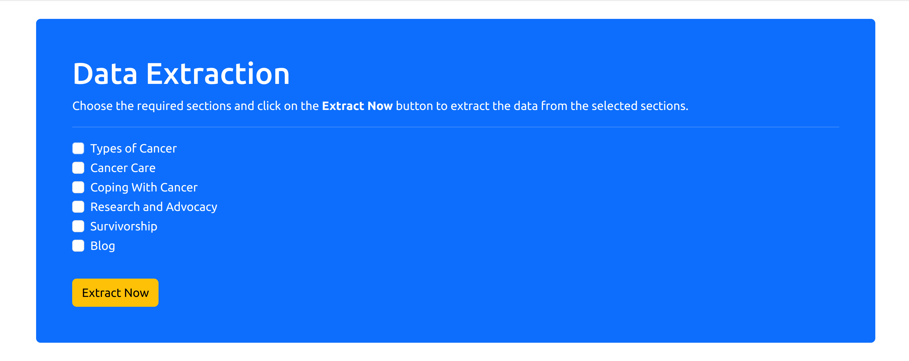

# Web scraping cancer data (cancer.net)

## Overview


This project involves leveraging web scraping techniques to extract cancer-related data from cancer.net, including types of cancer, cancer care, coping with cancer, research and advocacy, survivorship, and blog information. It will help with your cancer-based NLP project and chatbot application.

## Features

- **Dynamic**: It's a dynamic application, so if any section of the website is modified, it will also be able to cope with the modifications.
- **Selection Option**: Select your desired section of cancer.net and extract the data from this specific section.

## Example



## Getting Started

### Prerequisites

- Python 3.x
- Beautiful Soup


### Steps to run

<div style="padding-bottom:10px"><b>STEP 00 :</b> Clone the repository</div>

```bash
git clone https://github.com/utpalpaul108/cancer.net-web-scraping
```
<div style="padding-top:10px"><b>STEP 01 :</b> Create a virtial environment after opening the repository</div>

Using Anaconda Virtual Environments

```bash
conda create -n venv python=3.10 -y
conda activate venv
```
Or for Linux operating system, you can use that

```bash
python3.10 -m venv venv
source venv/bin/activate
```

<div style="padding-top:10px; padding-bottom:10px"><b>STEP 02 :</b> Install the requirements</div>

```bash
pip install -r requirements.txt
```

Finally, run the following command to open your application:
```bash
python app.py
```

<div style="padding-top:10px"><b>STEP 03 :</b> Open the application</div>

Now, open up your local host with a port like that on your web browser.
```bash
http://localhost:5000
```

After opening the application, you will find a list of sections. Here, you can select any specific section and extract the data from that section.